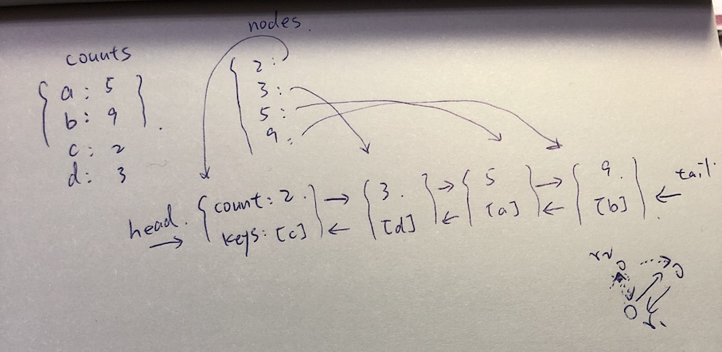

## README

### Algorithm

<p align="center">
  
</p>

#### Inc

```
if (nodes[count] not exists) {
  create node
  add key to node
  position = if count - 1 exists
    ? nodes[count - 1]
    : head
  splice to position
} else {
  get node
  add key to node
}
if (previous node exists) {
  delete key from previous node
  if (previous node is empty) {
    delete previous node
  }
}
```

#### Dec

```
if (key not exists) return
dec counts of key
if (nodes[count] not exists) {
  create node
  add key to node
  position = nodes[count + 1]
  splice to position
} else {
  get node
  add key to node
}
if (previous node exists) {
  delete key from previous node
  if (previous node is empty) {
    delete previous node
  }
}
```
