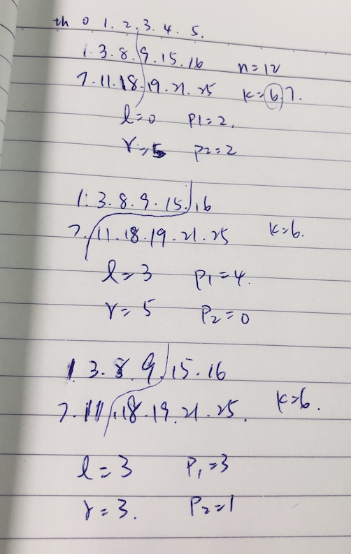

## README

<p align="center">
  
</p>

```
arr1 = [1, 3, 8, 9, 15]
arr2 = [7, 11, 18, 19, 21, 25]
--
n1 = 5
n2 = 6
n  = 11
k  = 6
--
left: left ptr in arr1
right: right ptr in arr2
p1: left partition index of arr1
k : kth element index starting from 1
    kth element also means number of elements at the left
k = p1 + 1 + p2 + 1
p2 = k - p1 - 2
```

### References

- [[Youtube] Binary Search : Median of two sorted arrays of different sizes](https://www.youtube.com/watch?v=LPFhl65R7ww)
- [MedianOfTwoSortedArrayOfDifferentLength](https://github.com/mission-peace/interview/blob/master/src/com/interview/binarysearch/MedianOfTwoSortedArrayOfDifferentLength.java)
