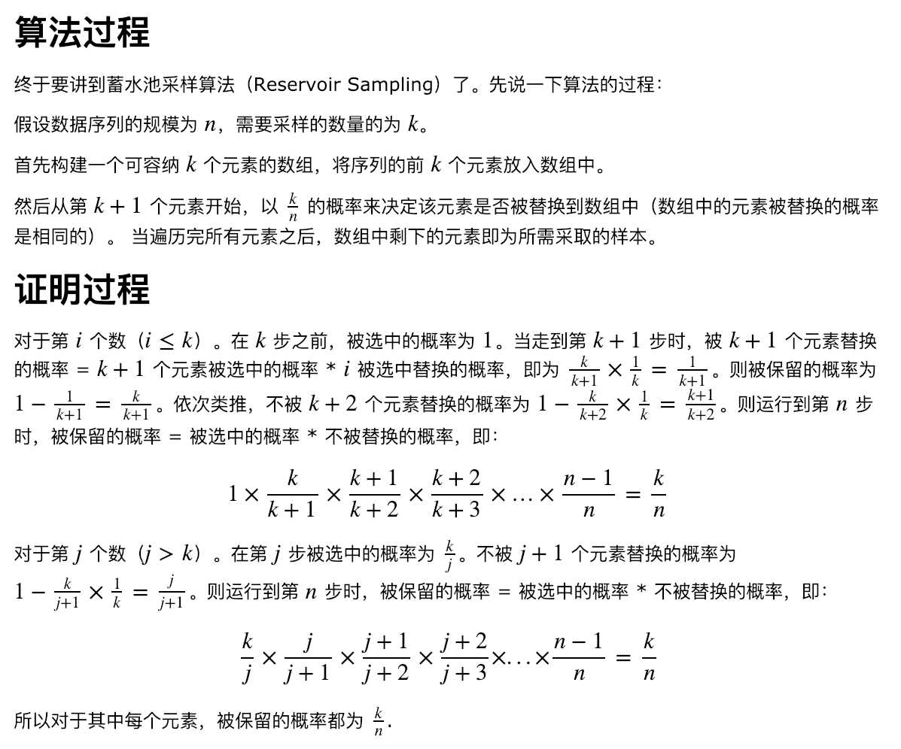

## README

### Algorithm

- Use Reservoir Sampling algorithm to pick items from large data or stream of data randomly.
- [Detail Explanation of Reservoir Sampling](https://www.cnblogs.com/snowInPluto/p/5996269.html)



```js
// create sampler with size of k
const createSampler = ({ k }) => {
  const arr = [];
  let i = 0;
  return {
    // when sample is called, do different actions depending on current state (i).
    sample: (element) => {
      if (i < k) {
        // for the 1th ~ kth elements, they are selected with 100% probability.
        arr.push(element);
      } else {
        // for the k + 1 th elements, we choose a random integer between (0, i).
        // if the random integer is smaller than k, replace arr[r] with element.
        const r = Math.floor(Math.random() * (i + 1));
        if (r < k) {
          arr[r] = element;
        }
      }
      i += 1;
    },
    getData: () => {
      return arr;
    },
  };
};
```
